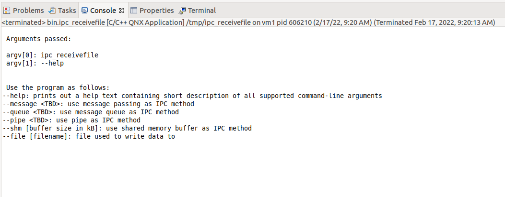
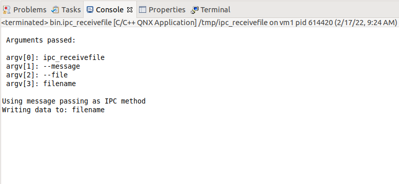
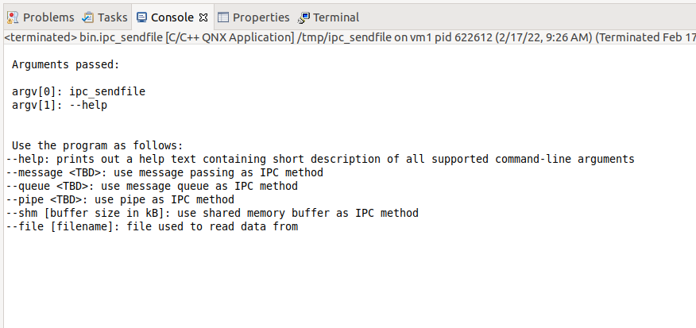
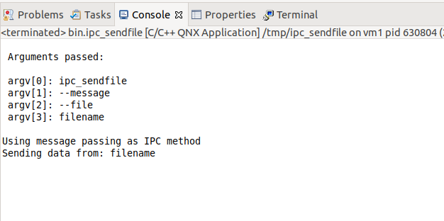
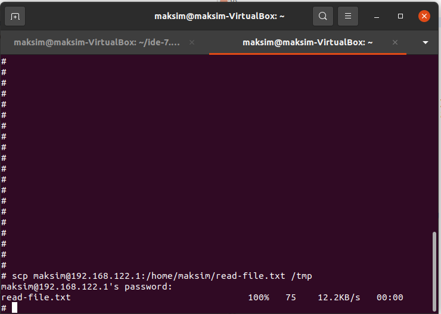
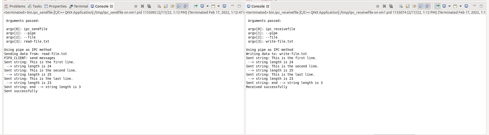
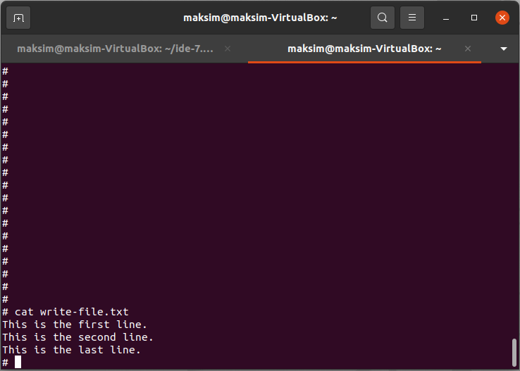

# IPC task

The program shall accept the following command-line arguments:

- "--help" shall print out a help text containing short description of all supported command-line arguments
- "--message TBD" shall use message passing as IPC method
- "--queue TBD" shall use message queue as IPC method
- "--pipe TBD" shall use pipes as IPC method
- "--shm [buffer size in kB]" shall use shared memory buffer as IPC method (remember mutexes/semaphores!)
- "--file [filename]" file used to read/write data

## To do

- [x] setup command-line arguments
  - [x] send
  - [x] receive
- [x] add pipe functionality
  - [x] send
  - [x] receive
- [ ] add message passing functionality
  - [ ] send
  - [ ] receive
- [ ] add message queue functionality
  - [ ] send 
  - [ ] receive
- [ ] add shared memory functionality
  - [ ] send
  - [ ] receive

## Command line arguments

`ipc_receivefile --help`



`ipc_receivefile --message --file filename`



`ipc_sendfile --help`



`ipc_sendfile --message --file filename`



## Pipe

1. Copy [a text file](read-file.txt) into `/tmp` folder:

```shell
scp maksim@192.168.122.1:/home/maksim/read-file.txt /tmp
```



2. Start ipc_receivefile as follows:

```shell
ipc_receivefile --pipe --file write-file.txt
```

3. Start ipc_sendfile as follows:

```shell
ipc_sendfile --pipe --file read-file.txt
```

Now `read-file.txt` should be sent through a pipe line-by-line to `ipc_receivefile` process and written to `write-file.txt`:





